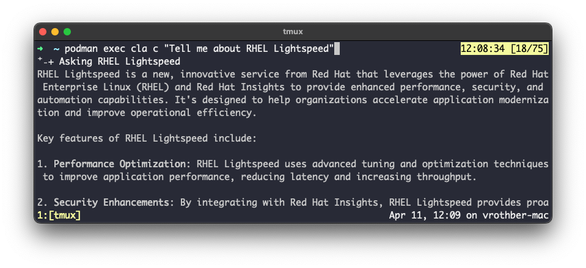

# containerized-command-line-assistant
A Fedora container shipping [rhel-lightspeed/command-line-assistant](https://github.com/rhel-lightspeed/command-line-assistant).

## Usage

The command-line-assistant has dbus dependencies which requires systemd to be PID1 inside the container.  Hence, we first need to run the container and can then interact with it via `podman-exec`.

NOTE that your host system must be registered via subscription-manager.  If you are using Podman Desktop (e.g., on MacOS), you can easily register your machine (and get a free [Red Hat Developers Subscription](https://developers.redhat.com/about?source=sso)) via the [Red Hat Account Extension](https://github.com/redhat-developer/podman-desktop-redhat-account-ext).  Otherwise, run `$ sudo subscription-manager register` and provide your Red Hat credentials.

The image is available at `quay.io/vrothberg/command-line-assistant:41`.

### Start the container

`$ podman run --detach --rm --name=cla quay.io/vrothberg/command-line-assistant:41`

Note the `--detach` as systemd is PID1.  Interactions need to go through `podman exec`.

### Interact with the command-line-assistant

